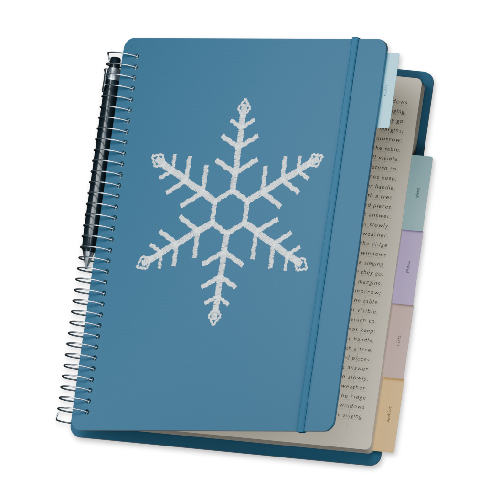
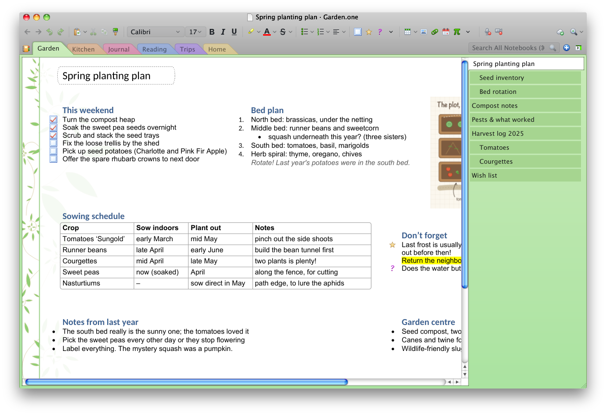

<h1>
  
  Snowbound — Freeform note taking
</h1>

Type and draw notes on any platform, while maintaining ownership of your data.
Snowbound does not use a typical markdown or structured note format, but rather
uses rich text on a free canvas. Unlike other infinite canvas apps, our canvas
feels more like a standard text editor software as textboxes automatically
create and resize as you would expect. In addition, Snowbound supports
pen and drawing tools [(WIP)](https://shale.paperclover.net/snowbound/issues/21), recording audio and video
[(WIP)](https://shale.paperclover.net/snowbound/issues/36), revision
history, multi-machine live collaboration, and much more.

<!-- Regenerate from the sample notebook (edit it freely in OneNote or Snowbound):
python3 tools/canvas/build_macos.py --release && d=$(mktemp -d) && cp -R docs/sample-notebook/Personal "$d" && target/Snowbound.app/Contents/MacOS/Snowbound --notebook "$d/Personal" --cache "$d/cache" --settings "$d/settings.json" --screenshot docs/screenshot
-->
<picture>
  <source media="(prefers-color-scheme: dark)" srcset="docs/screenshot-dark.png">
  
</picture>

Snowbound implements the file and sync protocol used in 2010 Microsoft OneNote,
so notebooks are fully compatible, including collaboration features. It supports
OS X 10.6 Snow Leopard, all the way to modern macOS, Linux, Windows
[(WIP)](https://shale.paperclover.net/snowbound/issues/11), and fully capable
iOS[(WIP)](https://shale.paperclover.net/snowbound/issues/36) and
Android[(WIP)](https://shale.paperclover.net/snowbound/issues/24) apps.

For my songwriting for *[paper clover](https://paperclover.net)*, I use this app
alongside OneNote on my Windows 7 laptop.
